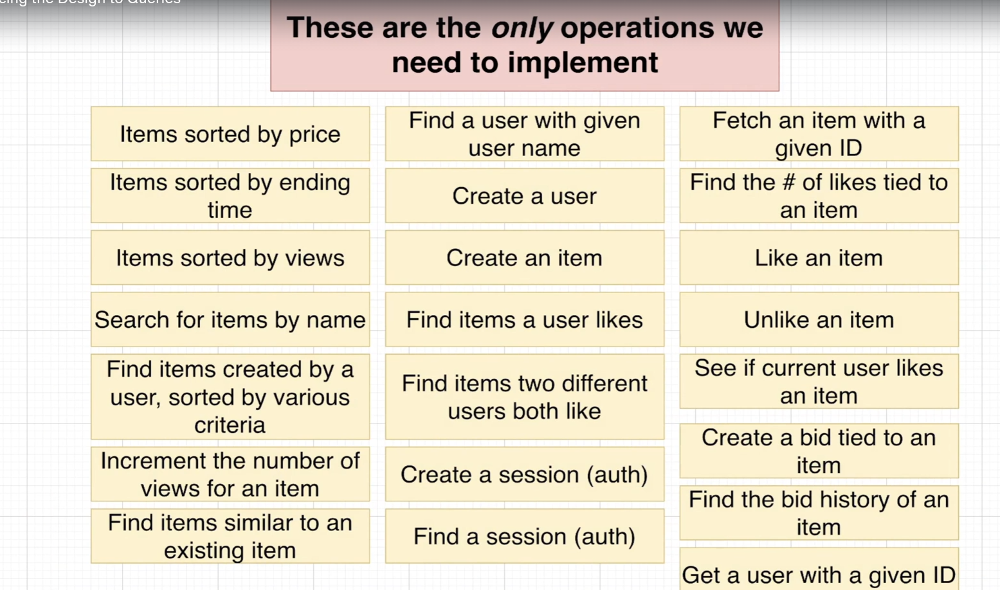
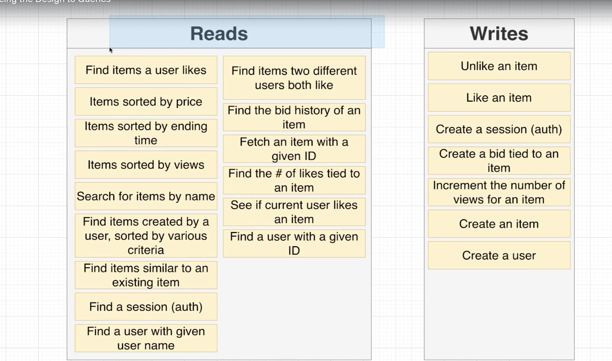

# REDIS TUTORIAL
> Use nnh1810k2003@gmail.com in rbook.com to see basic command and idea about redis
### 1. Design redis

##### What we need to concern to create redis:
- Type of data storing
- concerned about what we will store in redis: (should be static pages). If we store dashboard in redis, each user have a single dashboard,
 and they want to reload to get new newfeeds, as a result, you have to store for each user each key and value,
 which can lead to overwhemling data. We should convern about a static data such as contact info, sign in and sign out.
- key naming is essential, because it is unique and can be updated and people who looking for is easy. Tip: use ':' to seperate part of key, '#' for unique ID
For example: pagecached#privacy, pagecached#auth/sigin (saved base router)
### 2. Redis design patters
What we care all about is speed in redis

We should care about read and write

##### Reason using hash
- They store multiple of attribute. For example: items have URL, price,... They should be stored in hash
- A collections of these records can be sorted in different way
- Often Need to access single record at a time(session, users)
##### Dont use hash
- Only a uniqueness (Each user have liked item seperately, so saving this records in redis can lead to waste of resources).
- Record only store  one or two attribute.
- records use for time series data(update from time to time)

##### Notation when getting hashes from redis.
- Redis always save our hashes to string. In some case, returning value for app can make a huge problems.For example, revenue is expected to be integer, but received String. As a result, we have to serialize and deserialize to returns the correct fields and correct values. Serialize is setup object ready to hash and turn them to queryable format. Deserialize is formats data from redis, parse String to plain number

>  We want to get a lot of ID rather than loop to get each HGETALL, you can create pipeline run multiple command 
